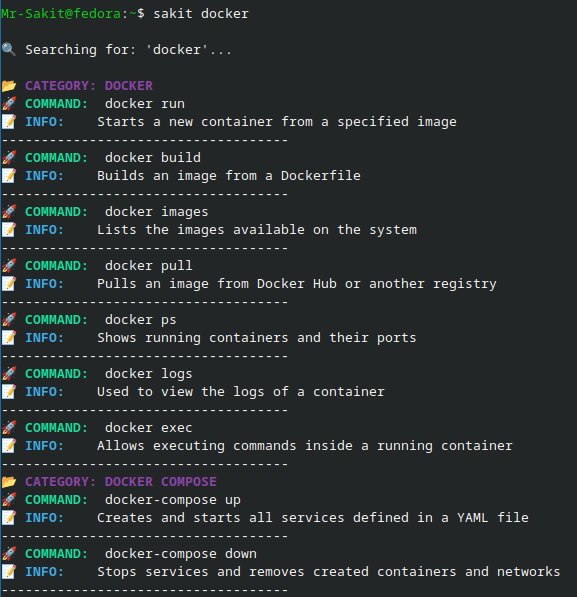
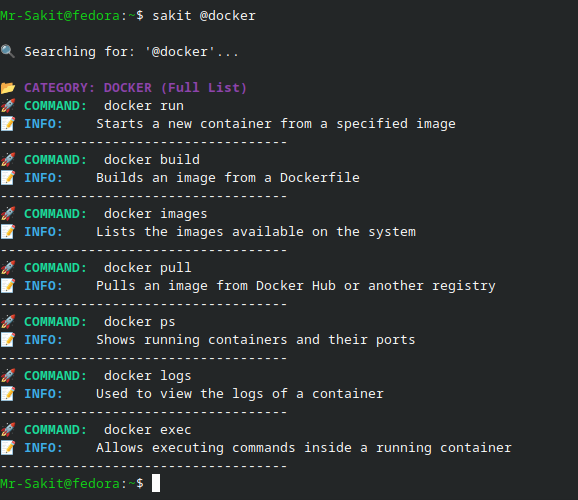

# Sakit-DB: Personal DevOps Knowledge Base

Sakit-DB is a lightweight, terminal-first knowledge base for DevOps commands. It stores everything in Markdown and provides fast search, quick entry, and optional auto-sync to GitHub.

## Key Features

- **Fast search:** Find commands directly from the terminal.
- **Category listing:** Browse all available command groups with `sakit list`.
- **Install/uninstall helpers:** Install or remove common DevOps tools from one repo.
- **Preview mode:** Show install/uninstall commands without running them.
- **Doctor checks:** Validate project files and local setup with one command.
- **Explain mode:** Read longer notes for selected commands.
- **Quiet execution:** Install/uninstall output stays clean unless an error occurs.
- **Quick entry:** Add a single command or use bulk entry for speed.
- **Auto-sync:** Updates can be committed and pushed automatically.
- **Markdown storage:** Data lives in `commands.md`, readable in GitHub or Obsidian.

## Project Files

- `devdb.sh` - Main script: search, add, bulk add, category list, install/uninstall helpers.
- `commands.md` - Command database (categorized).
- `explanations.md` - Longer command explanations and usage notes.
- `installations.md` - Installation steps per tool and package manager.
- `uninstallations.md` - Uninstall steps per tool and package manager.
- `setup.sh` - Adds the `sakit` alias to your shell.

## Usage

### Search
```bash
sakit docker
```
Example output:


### List a Category
Supports multi-word categories:
```bash
sakit @docker
sakit @docker compose
```
Example output:


### List Available Entries
```bash
sakit list
sakit install list
sakit uninstall list
```

### Explain a Command
```bash
sakit explain "docker run"
sakit explain "kubectl apply"
```

### Install and Uninstall Tools
Default mode keeps output quiet and only prints command output if an error occurs:
```bash
sakit install micro
sakit uninstall micro
```

Preview commands without executing them:
```bash
sakit install docker -show
sakit uninstall docker -show
```

Use verbose mode to see every command's full output:
```bash
sakit install docker --verbose
sakit uninstall docker --verbose
```

### Health Check
```bash
sakit doctor
```

## How It Works

1. Capture input via terminal or temp file.
2. Parse into Markdown items (`* **cmd** : desc`).
3. Append to the right category in `commands.md`.
4. Optionally commit and push to GitHub.

## Installation

1. Clone the repo:
   ```bash
   git clone https://github.com/Mr-Sakit/devops-kb.git
   ```
2. Enter the repo:
   ```bash
   cd devops-kb
   ```
3. Make setup executable:
   ```bash
   chmod +x setup.sh
   ```
4. Run setup (adds alias and makes script executable):
   ```bash
   ./setup.sh
   ```
5. Reload your shell:
   ```bash
   source ~/.bashrc
   ```
